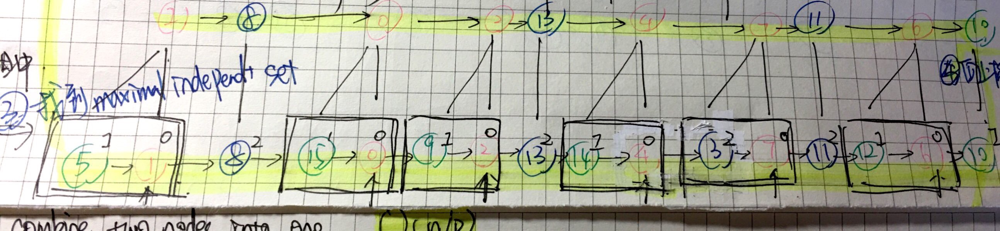
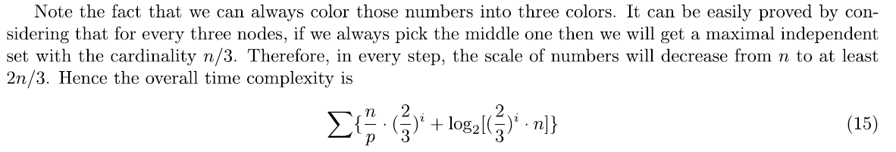

# Homework 2

姓名： 来舒悦
学号： 3150105330
计算机科学与技术 1507

## Prefix Sum
1. (20 points) Write a parallel program to compute **prefix sum** for an array of **n numbers** using **n processors**.  
- Imitation:
   
- Step1:  
   Replace every number with the sum of itself and the number before it by 1, 2, 4 and so on until no number changes.  
   - Complexity:  O = log2(n)  
   - Pseudocode:
```c
   for(i=0; i<log2(n); i++)
   {
   	node_num = 2^i;		// number of node in sum
   	for(j=2^i : n)  do in parallel
    	sum[j] = sum[j] + sum[j-node_num];
   }
```

2. (20 points) Write a parallel program to compute **prefix sum** for an array of **n numbers** using **p<n processors**.
   
- Step1:  
   - Divede n numbers into p groups and each group has n/p numbers. Use serial algorithm first to get prefix sum for numbers in each group.  
   - Complexity: O = n/p  
   - Pseudocode:
```c
    for(j=1 to n/p)p processors do in parallel
    {
   		for(i=1; i<n/p; i++) 
   		{
   			group_index = j*n/p;
        	sum[group_index+i] = sum[group_index+i] + sum[group_index+i-1];
   		}
   }
```
- Step2:
   - Replace every group prefix with the sum of itself and the sum before it by 1, 2, 4 and so on until no number changes. Similar to question 1 because there are n numbers and n processors now. 
   - Complexity: O = log2(p)
   - Pseudocode:
```c
   for(i=0; i<log2(p); i++)
   {
   	node_num = 2^i;		// number of node in sum
   	for(j=2^i : n)  do in parallel
        {
    		sum[j] = sum[j] + sum[j-node_num];
        }
   }
```
- Step3:
   - Update each number by adding group prefix and its prefix in the group.
   - Complexity: O(n/p)
   - Pseudocode:
```c
   for(j=1 to n/p)p processors do in parallel
   {
   	for(i=1; i<n/p; i++) 
   	{
   		group_index = j*n/p;
   		// current = in_group_prefix_sum + group_prefix_sum
        	sum[group_index+i] = sum[group_index+i] + sum[group_index-1]; 
   	}
   }
```
- Total Complexity: O(n/p + log2(p))

## Parallel Sorting
3. (20 points) How to sort **n integers in {0, 1, …, n/p-1}** using **p<n processors** in **O(n/p+logn) time**? 
- Example   
     
     
- Step1:
   - Divide n numbers into p groups, each group has n/p numbers from 0 to (n/p-1) and one processor. Each processor serially check each number and put it into the right position. For example if processor_i check the j_th number whose value is n/p-1, then put this number in the i_th bucket and the n/p-1 position.
   - Complexity: O(n/p)
   - Pseudocode:
```c
   for(i=0 to p) do in parallel
   {
    bucket_index = i * p/n;
   	for(j=0; j<n/p; j++)
   	{
   		check num[bucket_index+j] value as v;
		put number in bucket[i][v];
	}
   }
```
- Step2:
   - There are n position and start from small number to large number. Then calculate their prefix number as question2 mentioned before with n numbers and p processors which p<n.
   - Complexity: O(n/p +llog(p))
- Step3:
   - Sort according to the prefix sum. Number with larger prefix sum means is larger. 
- Total Complexity: O(n/p + log(p))
   - Since p<n, the main part is n/p. Thus, O(n/p+log(p) = O(n/p+log(n)  
   
4. (20 points) How to sort **n integers in {0, 1, …, (n/p-1)^c}** using **p<n processors**?
   - Similar to question 3 but need to sort recursively. Still divide n numbers into p groups while each position may represent multiple numbers. Recursively divide until each position represent single number. 

## Prefix Sum and Binary Tree
5. (20 points)  Work out the **prefix sum** in the following tree, draw the result after each parallel step. You can do this problem by handwriting or copy the figure provided here.  
  
- Step：
   - 每一个节点都会收到一个信号值，该节点将信号值传递给左叶子，然后将左叶子的值与信号值的和传递给右叶子。当信号传递到底部的时候就可以得到预期的a_0k也就是prefix sum.
   - 

## Linked List
6. (20 points) Write a parallel program to compute **prefix sum** for a **linked list** of n elements using n processors.  

   

- Step:
   - Use pointer jumping, let A[i].next = A[i].next.next  
```c
	for(i=0; i<lgn; i++)
	{
		for(j=0 to n-1) do in parallel
        {
            if(A[j].next != NULL)
            {
                A[j] += A[j].next;
                A[j].next = A[j].next.next;
            }
        }
	}
```

## Radix Sort
7. (20 points) Give an example that **radix sort** does not work if sorting from high order digit to low order digit. Explain why. Give an example that radix sort does not work if the base sorting algorithm is not stable. Explain why.
- Example:
   22 31 13 
   - high order:
   (i) 13 22 31
   (ii) 31 22 13
   WRONG
   - low order:
   (i) 31 22 13
   (ii) 13 22 31
   RIGHT
   - Explaination: higher digit dicided which number is larger. Thus, higher digit has higher priority and should start sort from lower digit. Then, when higher digit is larger than the others, it can sort in a correct way.
   - Stable: 假定在待排序的记录序列中，存在多个具有相同的关键字的记录，若经过排序，这些记录的相对次序保持不变，即在原序列中，ri=rj，且ri在rj之前，而在排序后的序列中，ri仍在rj之前，则称这种排序算法是稳定的；否则称为不稳定的。  
   - If base sort algorithm is selection sort which is not stable, then the result turns out not to be stable too. Because radix sort use keyword to as the main point to sort, if the keyword is not a stable algorithm. Then the radix sort will also not be stable.  
     

## Linked List

1. (20 points)  
  a). Show a parallel step of symmetry breaking for the following linked list (color it with 2logn colors).  
   Address:  
   
   Data:  
   

  相当于先染色使相邻节点颜色不一样。  
   
```c
divide into p groups and do following in parallel:
for(i=0; i<n/p; i++) 
{
	dif = map(A[i], A[i].next);	// find the highest different digit positions
	if(A[i] to A[i].next == forward)
    {
    	A[i] = color[dif][1];	// color for forward
    }
    else if(A[i] to A[i].next == backward)
    {
    	A[i] = color[dif][2];	// color for backward
    }
}
```
Complexity: O(n/p)  with log2(n) colors  

b). Sort these nodes by their coloring. What is the time if the linked list has n nodes and you have p< n processors?  
然后每种颜色内部进行排序。  
- Step1:  
   There are 5 different colors and assume there are 5 buckets. Suppose there are n0 numbers with color 0, n1 numbers with color1, and so forth. Then we may process one colors in one round.   
```c
for(i=0; i<5; i++) 
{
	for(j=0; j<n[i]/p; j++)
    {
        check num[j] value as v;
	    put number in color[i][v];
    }
}
```
- Step2:  
   Add prefix sum and sort which similar to above.   
- Complexity:   
  
  
c). Show going through sorted node and convert their colors to 3 colors. Show every step. How much time you need if the linked list has n nodes and you have p< n processors?
将多种颜色转化为3种颜色，因为3种颜色就可以保证相邻节点颜色不一样了。  
- Step1:  
   Re-coloring: check each node and change colors with only 3 colors left.  
```c
	divide into p groups and do following in parallel:
	for(i=0; i<n/p; i++)
	{
        if(A[i] != color1 || A[i] != color2 || A[i] != color3  )
        {
        	A[i] = color_set - A[i-1] -A[i+1]; 
		}
	}
```
- Complexity: O(n/p)  

d). Combine nodes colored with 0 with its left neighbor (pairing-off). Then look at nodes colored with 1 and if its left neighbor has not been paired-off then combine its left neighbor with itself. Then look at nodes colored with 2 and if its left neighbor has not been paired-off then combine its left neighbor with itself. If the original linked list has n nodes now how many nodes at most are remaining after pairing-off?
- 2 * n/3
  

e). Nodes being paired-off left vacant spot in the array containing the linked list. Mark nodes that has been taken in pairing-off with 1’s and mark nodes that still in the linked list after pairing-off with 0’s and sort nodes by these marked 0’s and 1’s.  

f). After sorting, nodes remaining in linked list are packed to the front of the array.



g). a) to f) is one round. How much time does it take for such a round in terms of n and p?


h). How many times you need to repeat the round of a) to f) to contract the linked list into one node?

- Since at most 2n/3 numbers of last layer will left.   

- Then add i times of n/p + log2n. 

  


9. (20 points)  How to compute a preorder, inorder or  postorder traversal numbering of a binary tree using linked list prefix?
   - Ref: https://www.geeksforgeeks.org/given-linked-list-representation-of-complete-tree-convert-it-to-linked-representation/
   - 《An introduction to parallel algorithms - Joseph Jaja》 P188
