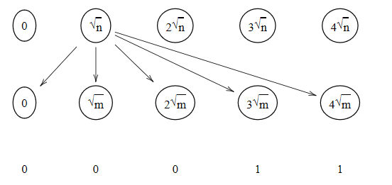
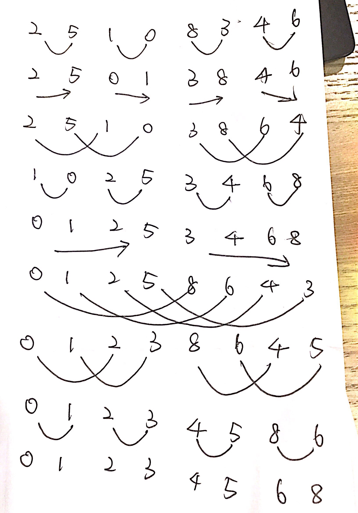

# Homework4   

## Bipartite Graph

1. (20 points) Give a parallel algorithm that computes edge coloring of a bipartite graph that has degree 2^k.

- Similar to 3 coloring of linked list. Each vertex is stored in a unique address and XOR the address of linked vertexes. Because of each address is unique, the result of address is unique too. 
- Use 2^k processor to color each edge with 2^k colors which is similar to the completed graph of finding the minimal. Thus, the bipartite graph will be colored in Time = O(1).

##  Valiant's Merging

2. (20 points) How to merge two sorted lists of n elements each in O(n/p+loglogn) time using p processors?

- Assume the two sorted lists are A and B. Divide n elements in each list into n^(1/2) groups and n^(1/2) elements in each group. Link each group from A to each group from B and there are total n edges which need n processors.

- 

  (in this question, n=m) Then each processor compare the number and mark them. The bigger one is marked with 1 and the smaller one is marked with 0. Therefore, the number should be merged between 0 and 1 which means the left neighbor is smaller than it and the right neighbor is bigger than it. O(1)

- Then we can recursively solve this problem. We can divide each group which has n^(1/2) numbers into n^(1/2)^(1/2) = n^(1/4) groups with n^(1/4) numbers in each group. Do this recursively and we can get the equation T(n) = 1 + T(n^(1/2)) = i + T(n^(1/2^i))

- n^(1/2^i) = 1 --> i = loglog n

- Therefore, Time = O(n/p + loglogn)

  

3. (10 points) Does Valiant’s fast merging algorithm require **concurrent read** ? Does it require **concurrent write**?

- Yes. Both concurrent read and concurrent write are required.

- Concurrent read. According to the picture from last question, for each group, there will be n^(1/2) processors require to read the value of this group and to compare with it. Therefore, concurrent read is required.

- Concurrent write. It should be depend on how processor store the information. If the result of each group compared with all other groups is  stored in the same memory. For example, the result of A[i] compare to all other groups from B is stored in a memory. Then, concurrent write is required. 

   

## Bitonic Sorting

4. (20 points) If there are 8 input elements 2, 5, 1, 0, 8, 3, 4, 6. Show every step in the bitonic sorting process to have them sorted.

5. (Research problem): If a linked list of length n is already oriented, can you use n processors to color it with 3 colors in less than loglog*n time?

 

6. (Research problem): How do you sort n integers packed in m words using p processors.